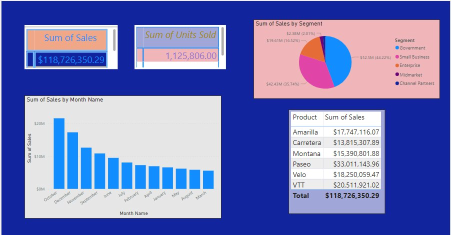
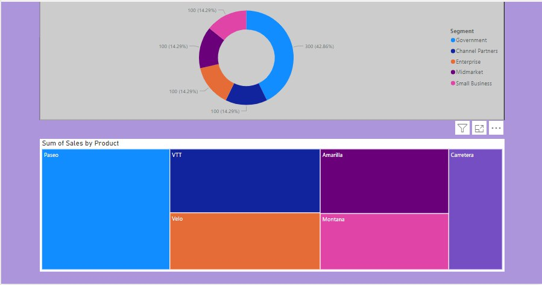

# Financial Dashboard

Welcome to the **Financial Dashboard**, an interactive tool designed to provide comprehensive insights into financial data. This dashboard enables users to analyze financial metrics, track performance, and make informed decisions based on various financial indicators.

## Demo





## Features

- **Interactive Visualizations**: Explore data through dynamic charts, graphs, and tables.
- **Expense Tracking**: Monitor and categorize expenses to manage budgets effectively.
- **Revenue Analysis**: Analyze revenue streams and identify trends over time.
- **Profit & Loss Statements**: View detailed profit and loss statements to assess financial health.
- **Customizable Reports**: Generate and customize financial reports based on specific criteria.
- **Data Filtering**: Apply filters to view data by date range, category, or other parameters.

## How to Use

1. Clone the repository to your local machine:
    ```bash
    git clone https://github.com/AdityaSrivastavDS/Financial-Dashboard
    ```

2. Open the financial dashboard file (`Financial Dashboard.pbix` or relevant file) in [Microsoft Power BI Desktop](https://powerbi.microsoft.com/desktop/).

3. Interact with the dashboard by using filters and slicers to analyze different financial metrics and generate reports.

4. Export reports or share insights through Power BI service if needed.

## Requirements

- **Power BI Desktop**: Download and install from [here](https://powerbi.microsoft.com/desktop/).
- **Data Source**: The dashboard uses financial data, which can be updated or modified based on available datasets.

